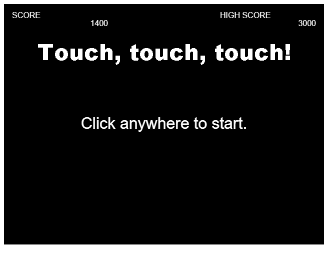
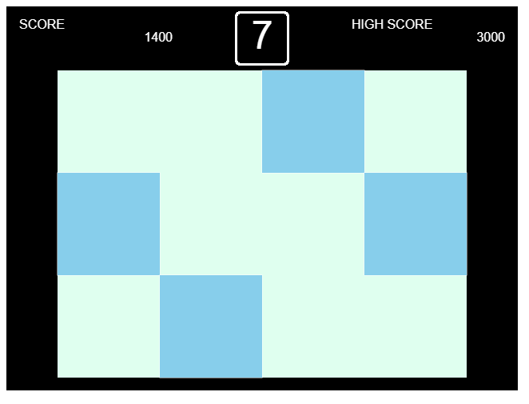



# Webgame | DjangoによるWebゲーム開発チュートリアル

## 演習概要

### 演習目的
Webゲームの開発を通じて、Webアプリケーションの仕組み、開発方法を学びます。

### 演習内容

PythonのWebアプリケーションフレームワークであるDjangoを主体に、HTML5+JavaScript、PostgreSQL等の技術を駆使して、オリジナルのWebゲームを開発します。

## 動機

学部3年生向けの演習科目でDjangoを用いたWebアプリケーションの開発方法を学習してもらうために作成しました。

## 到達目標

- Webゲーム開発を体験しながら、DjangoによるWebアプリケーション開発方法の基本を修得できる。
- Webゲームに関わるデータベース設計の基本を修得できる。
- HTML5 CanvasとJavaScriptによるWebインタフェース設計の基本を修得できる。

## 取り組み方

下記の目次に記載している事前準備を行ったうえで、01から順にチュートリアルに取り組んでください。各ページでコード等を交えながら解説しています。適宜、参考文献も示していますので、併せて参照してください。チュートリアルどおりにコードを打ち込んでいくことで、次の**完成イメージ**に示すようなサンプルゲームが出来上がります。

### 完成イメージ

#### Touch, touch, touch!
制限時間内にターゲットをひたすらタッチするゲーム（いわゆるもぐらたたき）です。

### 動作確認

本チュートリアルは以下の環境で動作確認しています。
- Linux Mint 20.1
- PostgreSQL 12.14
- Python 3.9.5
- Django 4.2
- Google Chrome 112.0.5615.49

### アレンジ

本チュートリアル完了後、例えば、下記のようにアレンジしてみると良いでしょう。
- 他の推薦システムを実装し、その推薦リストを提示する。
- ユーザを増やしたり、寿司のネタを増やしたりするなど、評価値行列を充実させる。
- 寿司の特徴量を設計し、内容ベース推薦システムを実装する。
- 寿司に対してタグを付与できるようにし、推薦に活用する。
- インタフェースを改良する。
- 寿司の画像をフリー素材や自作のものに置き換える。
- 寿司以外のドメインを対象にする。

## 目次

### 事前準備
- [環境構築](ja/setup.md)
- [PyCharmのインストールと設定](ja/pycharm.md)

### プロジェクトの作成と初期設定
- [01 プロジェクトの作成](ja/01.md)
- [02 開発用Webサーバの起動](ja/02.md)
- [03 アプリケーションの作成](ja/03.md)
- [04 アプリケーションの登録](ja/04.md)
- [05 言語とタイムゾーンの設定](ja/05.md)

### データベース環境の構築と設定
- [06 データベース環境の構築](ja/06.md)
- [07 データベースの設定](ja/07.md)

### 認証用アプリケーションの作成
- [08 認証用アプリケーションの作成と登録](ja/08.md)
- [09 カスタムユーザモデルの作成](ja/09.md)
- [10 マイグレーションの実行](ja/10.md)

### テーブル設計とモデル定義
- [11 ユーザ、アイテム、評価値テーブルの設計とデータの登録](ja/11.md)
- [12 推薦リストテーブルの設計とデータの登録](ja/12.md)
- [13 モデルの定義](ja/13.md)
- [14 クエリセットAPI](ja/14.md)

### ベーステンプレートとインデックスビューの作成
- [15 ベーステンプレートの作成](ja/15.md)
- [16 トップページの作成](ja/16.md)
- [17 インデックスビューの作成](ja/17.md)
- [18 URLディスパッチャ](ja/18.md)

### 推薦インタフェースの設計
- [19 キャンバスの実装](ja/19.md)
- [20 キャンバスへの描画](ja/20.md)
- [21 データベースからの推薦リストの取得](ja/21.md)
- [22 推薦スロットへの推薦リストの表示](ja/22.md)
- [23 キャンバスイベント処理の実装](ja/23.md)
- [24 さまざまな推薦システムによる推薦リストの取得](ja/24.md)
- [25 アイテム詳細ページの作成](ja/25.md)

### ログイン機能と評価値の登録
- [26 管理サイト](ja/26.md)
- [27 ログイン機能の実装](ja/27.md)
- [28 データベースへのデータの登録](ja/28.md)

### オフライン処理の実装
- [29 オフライン処理の実装](ja/29.md)

## 参考

### 推薦システムの基礎
- 奥健太，**『基礎から学ぶ推薦システム ～情報技術で嗜好を予測する～』**，コロナ社，2022．
- 廣瀬英雄，**『推薦システム ―マトリクス分解の多彩なすがた―』**，共立出版，2022．

### 推薦システムの実装
- 風間正弘，飯塚洸二郎，松村優也，**『著推薦システム実践入門 ―仕事で使える導入ガイド』**，オライリー・ジャパン，2022．
- 与謝秀作，**特集3 最新レコメンドエンジン総実装 協調フィルタリングから深層学習まで**，WEB+DB PRESS Vol.129，pp.69-100，技術評論社，2022．
- Kim Falk, **``Practical Recommender Systems''**, MANNING, 2019.

### Django
- [Django ドキュメント \| Django](https://docs.djangoproject.com/ja/4.1/)
- チーム・カルポ，**『Django4 Webアプリ開発 実装ハンドブック』**，秀和システム，2022．
- 横瀬明仁，**『現場で使える Django の教科書《基礎編》』**，NextPublishing Authors Press，2018．
- 横瀬明仁，**『現場で使える Django の教科書《実践編》』**，Independently published，2018．

## 作成者

龍谷大学 [推薦システム研究室](https://recsyslab.org/) 奥 健太
